# Household differential pairs experiments

## Introduction and context

A few years ago, following a post about discontinuities of reference planes planes, I stated that differential pairs were popular precisely because they are more tolerant to reference planes discontinuities than single-ended ones, typically due to the following causes:

* Change of reference ground plane in multilayer boards.

* Slot between voltage domains where a power plane is use as a reference plane.

* Slots in the copper pour due to traces inside for 2 layers PCBs using copper fills as ground planes.

Indeed, there is no fundamental physical reason for differential lines alone, without discontinuities, to have better performance than grounded single-ended lines.

After this discussion, I made preliminary experiments to confirm some of my ideas on the subjects, but I did not have time yet to make a more comprehensive test.

After a recent discussion a few weeks ago, I had an idea to perform quick and low cost experiments on the subjects which is presented now.

## Precisions on the statement

After some discussions telling that differential pairs are not totally immune to ground plane issues, some points must be precised:

* Even when differential pairs have a greater resistance to ground plane defects from a functional point of view, the parasitic common mode is likely to cause EMC emissivity issues.

* Some performance degradation is to be expected indeed.

* But the remaining performance is more likely to stay sufficient for functional operation than for single-ended lines.

* The slots are assumed thin, which corresponds to the most common cases.

* For a thin slot, the dominant effect is not the short section with increased impedance, precisely because it is short, but the current redistribution effect explained later.

## Lab session 1

### Materials

The only needed material is a low cost HDMI cable. Lowest cost as possible since it will be rather botched. The ticket showing the rather low cost can be seen. The cat is optional, although much welcome.

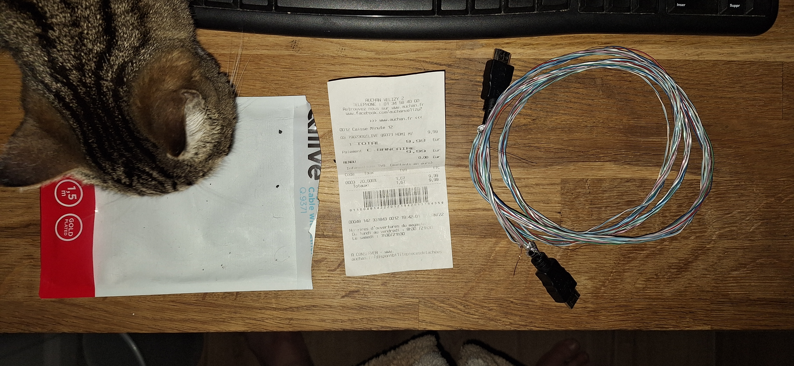

### Strongly coupled differential pair

First, as a reference, the HDMI pair is measured without its shields, both the outer shield and the inner shields of the pairs.

The small ground wire following the shields was left, even if disconnected. **It can be ignored for understanding of what follows**.

A picture was properly transmitted and displayed using this cable.

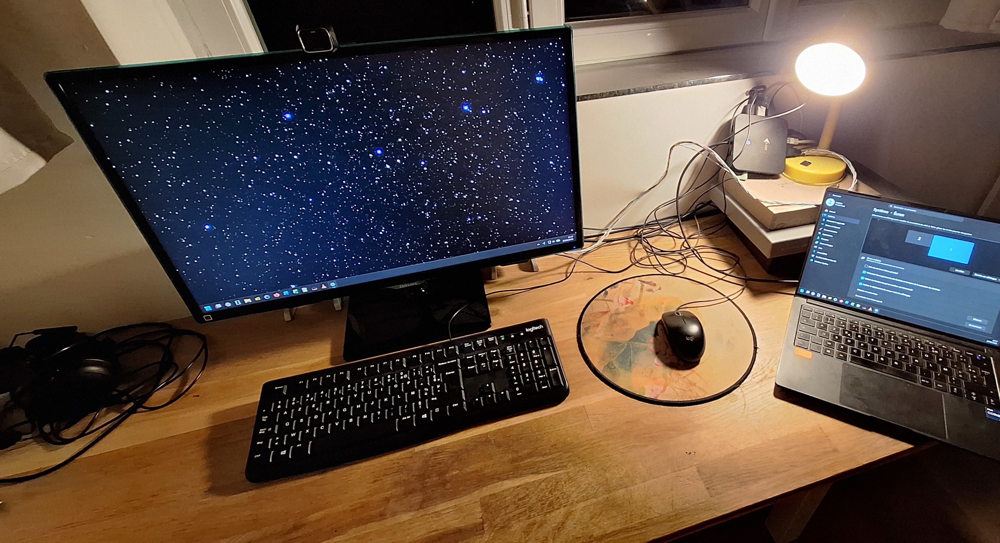

**Conclusion:** strongly coupled differential pairs don't need a ground "plane" for proper functional operation. ("Plane" in quotes because not plane for a cable, but has the same function.) Shielding is mainly for EMC issues. The question of DC connection to have proper common-mode DC voltage is left aside, but this point is rarely an issue in practice. This case is very common in cables, but in PCBs, the coupling is rarely sufficient to be able to work without a ground plane.

### Very loosely coupled differential pair, with or withound ground

The situation is very different for a loosely differential pair: the characteristic impedance of such lines without a ground plane is too high to ensure a proper operation. The ground plane allows to maintain a correct impedance despite the distance.

As shown below, loosely coupled differential pair without a ground plane have a too high impedance to ensure a proper operation:

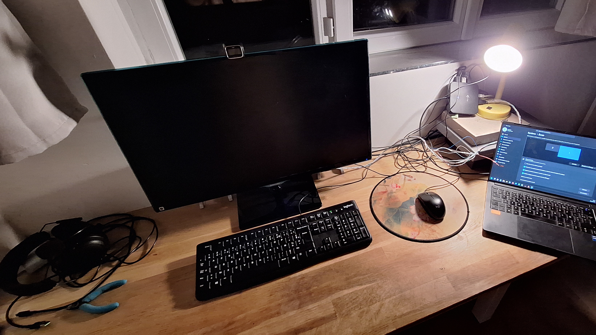

Adding a ground plane lowers this impedance and allows the differential pair to work again:

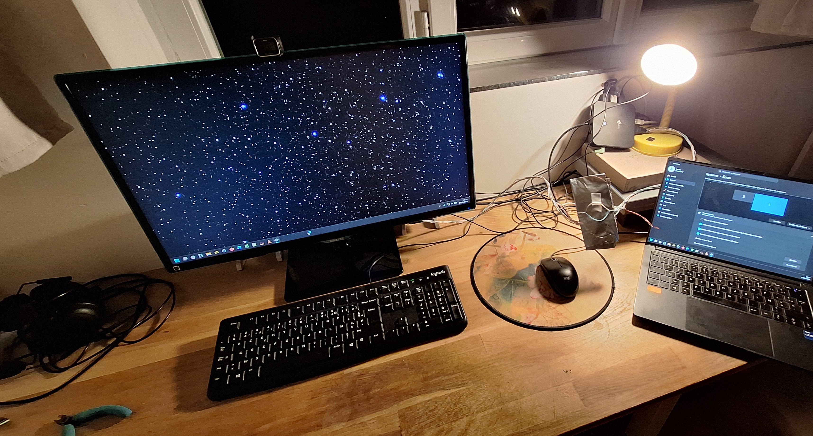

**However, it is important to note that this ground plane is not (properly) connected to the ground on each sides.** It is only an impedance effect. Indirectly, this test simulates two ground discontinuities before and after the ground plane.

**Conclusion:** when not strongly coupled, coupled differential pairs needs a ground plane to keep the impedance low enough, particularly on a PCB. However, the continuity of this ground does not seem to need to be perfect, as will be detailed later.

### Loosely coupled differential pair crossing a slot

For reasons which will be detailed later, very loosely coupled lines cannot cross a slot without damage.

However, normally loosely coupled lines, as typically seen in a PCB, can cross them without problems.

Pictures below show the displayed transmitted image and the test setup:

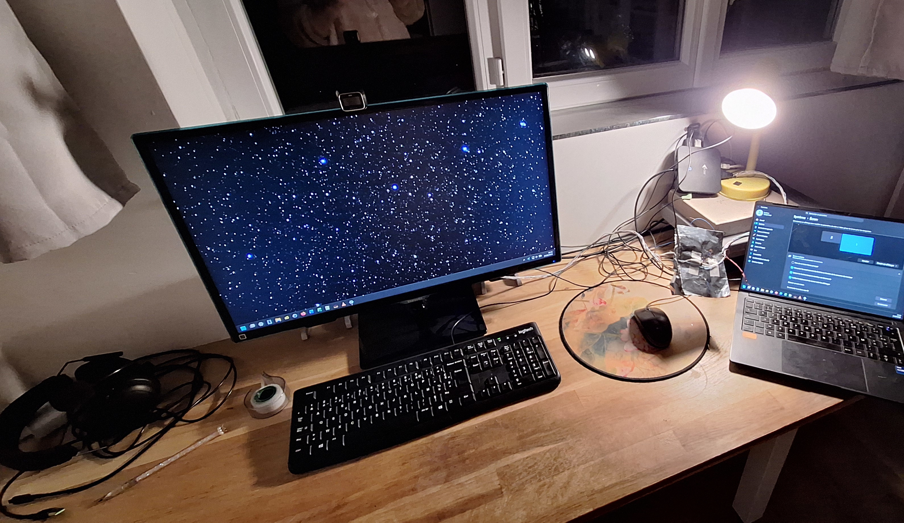

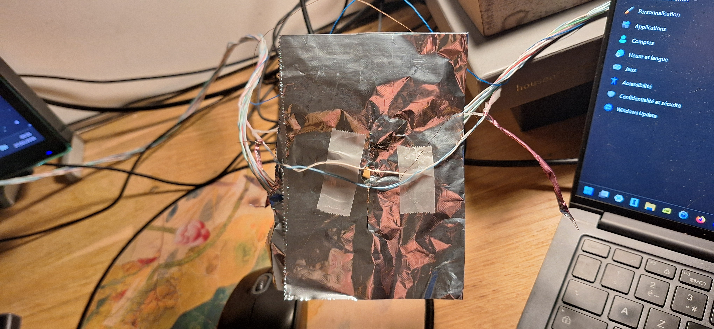

Unfortunately, the household means used for this setup made the slot very ugly and difficult to see on the picture.

Note that, even with a slot, the ground plane is needed to get the impedance. Sadly, during the lab session, the measurement with this spacing without the ground was forgotten.

The reason why differential pairs behave in this way is that, on the slot, the return current on each line connects with the return current of the other line, as shown in the picture below:

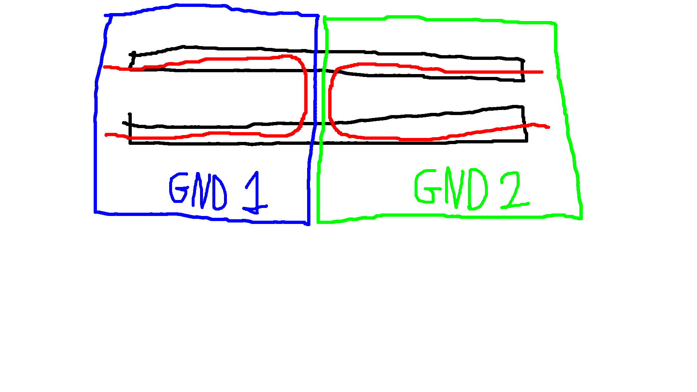

**Conclusion** due to the balance of the ground return currents, normally loosely coupled differential pairs (i.e. coupling typically used on PCBs) are tolerant to thin slots, even when the ground is needed for impedance.

### Demonstration of the return current balance by breaking it

To test this explanation, a setup where a second perpendicular slot, precisely intended to break the bridging current between the two return currents, was tested. The slots made with household ressources were unfortunately very, very ugly. Still, the results are as expected. Even if this does not make a proof, particularly due to the low quality of the slots, this give confidence for a second version of this setup:

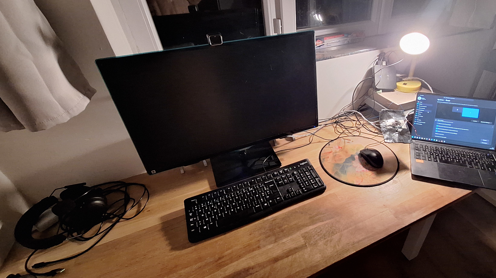

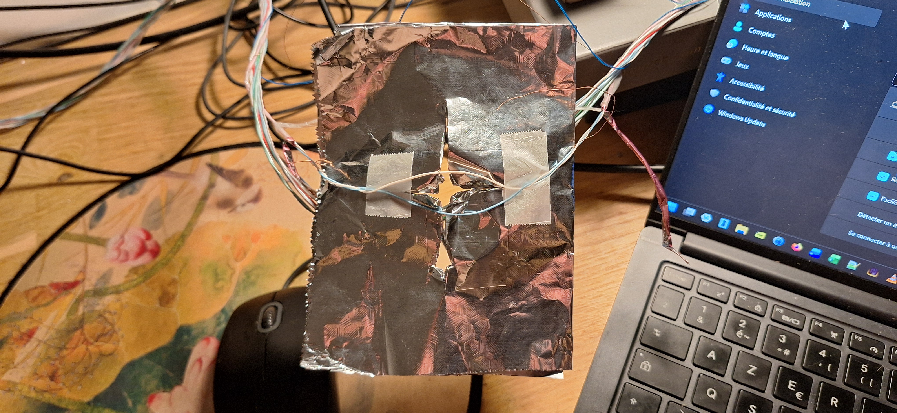

After this test, I took just in case some measurements, but for the following of the study I will probably make some calculations of EM simulations:

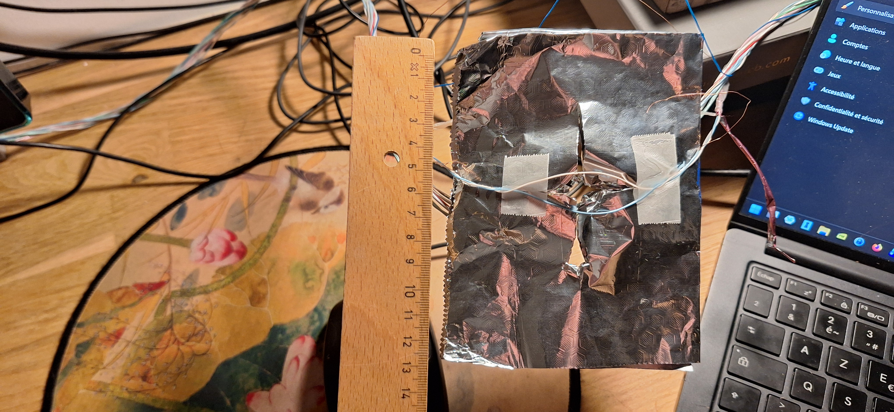

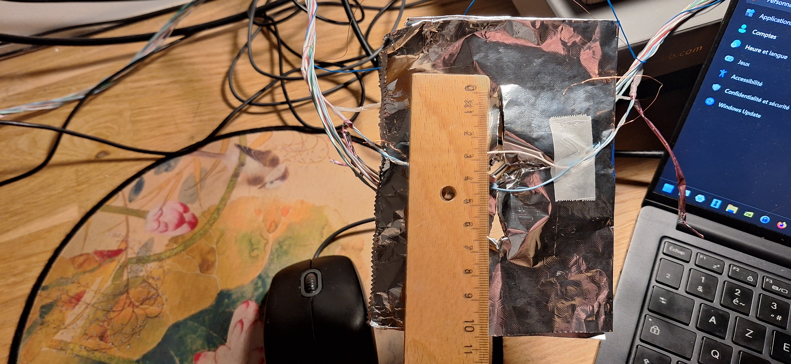

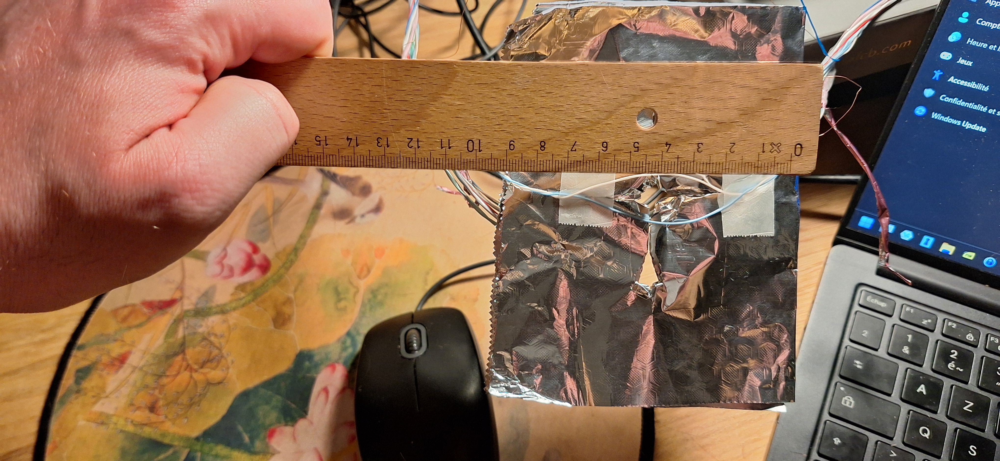

### Misc comments

Total time spent between first and last pictures: 48 minutes.

## Discussions about the frequencies

The screen used for the tests had a 1920×1080 resolution with a refresh frequency of 60 Hz. Assuming most common parameters for control data and sound channels, according to [https://en.wikipedia.org/wiki/HDMI#Resolution_and_refresh_frequency_limits](https://en.wikipedia.org/wiki/HDMI#Resolution_and_refresh_frequency_limits), a total bitrate of 3.20 Gbit/s is needed, that is 1.07 Gbit/s on each of the 3 data differential pairs, equivalent to a Nyquist frequency of 533 MHz.

Definitely not a very high speed differential pair. For instance, PCI Express uses 2.5 Gbit/s differential pairs since 2003 [https://en.wikipedia.org/wiki/PCI_Express#Comparison_table](https://en.wikipedia.org/wiki/PCI_Express#Comparison_table). Still an interesting experiment, particularly for electronics students.
